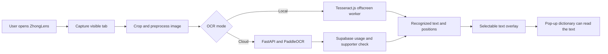

<p align="center">
  
</p>

<h1 align="center">Use a Pop-Up Dictionary Anywhere</h1>

<p align="center">
  A Chrome extension that uses OCR to turn Chinese text in images, videos, screenshots, and PDFs into selectable browser text.
</p>

<p align="center">
  
  
  
  
  
</p>

<p align="center">
  <a href="https://www.zhonglens.dev/try"><strong>Try the interactive demo</strong></a>
  &nbsp;|&nbsp;
  <a href="website/zhonglens/public/compressed_demo.mp4"><strong>Watch the demo video</strong></a>
</p>

<p align="center">
  
</p>

The green text above is ZhongLens's OCR overlay. It sits over text that was originally part of an image, allowing a separate pop-up dictionary extension to detect and explain it.

## Table of Contents

- [Project Overview](#project-overview)
- [What ZhongLens Does](#what-zhonglens-does)
- [How It Works](#how-it-works)
- [Technical Highlights](#technical-highlights)
- [Tech Stack](#tech-stack)
- [Repository Structure](#repository-structure)
- [Local Development](#local-development)
- [Environment Variables](#environment-variables)
- [API Routes](#api-routes)
- [Scripts](#scripts)
- [Common Development Tasks](#common-development-tasks)
- [Quality Checks](#quality-checks)
- [Troubleshooting](#troubleshooting)
- [Project Status](#project-status)

## Project Overview

Learning Chinese becomes slower when text is trapped inside a video frame, comic, scanned textbook, screenshot, or image-based PDF. A learner cannot select an unfamiliar character, and may not know its pronunciation well enough to search for it manually.

ZhongLens removes that friction. It captures the visible browser tab, recognizes Chinese text, and reconstructs the result as a selectable overlay in the correct position. Existing pop-up dictionaries can then interact with that overlay as if the page had contained normal HTML text from the beginning.

This repository is written for two audiences:

1. People reviewing the project who want to understand the product and its engineering decisions.
2. Maintainers who need to run, debug, or extend the extension, OCR service, or website.

## What ZhongLens Does

The project has three main parts.

### 1. Browser Extension

The extension is the main product. It provides:

- Full-page and cropped screenshot capture.
- Local OCR with Tesseract.js.
- Faster cloud OCR with PaddleOCR.
- Selectable text reconstructed over the original page.
- Adjustable OCR speed, crop, caption, and keyboard-shortcut settings.
- Supabase authentication and supporter status.
- Free cloud OCR usage tracking.
- An onboarding experience connected to the website demo.

### 2. Cloud OCR Backend

The FastAPI service:

- Accepts a browser screenshot as multipart form data.
- Validates empty, invalid, and oversized image uploads.
- Runs the PP-OCRv5 detection and recognition models.
- Tracks anonymous free usage in Supabase.
- Verifies signed-in users and checks supporter status.
- Returns text, confidence, and position data to the extension.

### 3. Website

The Next.js website provides:

- A public landing page and waitlist form.
- An interactive extension tutorial at `/try`.
- Supabase password-reset and signup flows.
- Stripe checkout, billing portal, and webhook routes.
- Waitlist email and unsubscribe handling through Resend.

## How It Works



The normal user flow is:

1. The user opens the extension or presses a configured shortcut.
2. The extension captures the visible browser tab.
3. The screenshot is cropped and resized according to the user's settings.
4. OCR runs locally or through the cloud backend.
5. The result is converted back into text elements positioned over the page.
6. A pop-up dictionary can now detect text that was previously only pixels.

ZhongLens does not replace a dictionary. It creates the selectable text layer that lets an existing dictionary work in more places.

## Technical Highlights

### Dual OCR Pipeline

Users can choose between two processing paths:

- **Local OCR** keeps processing inside the extension and uses Tesseract.js in an offscreen Chrome document.
- **Cloud OCR** preprocesses the screenshot in the browser, sends it to FastAPI, and uses PaddleOCR for recognition.

Both paths return a common result to the overlay, so the user interface does not need separate rendering systems.

### Browser Text Reconstruction

OCR output contains text and coordinates rather than ready-made HTML. ZhongLens scales those coordinates back to the browser viewport and draws a transparent text layer over the original content. This is the central feature that makes recognized characters selectable.

### Image Preprocessing

Before OCR, the extension can:

- Crop to a user-selected region.
- Match the screenshot to the CSS viewport size.
- Downscale large captures for faster processing.
- Convert images to grayscale.
- Apply a configurable threshold for local OCR.

### Authentication, Usage, and Billing

Supabase manages users and sessions. Anonymous installations receive a generated ID for cloud usage tracking. The backend uses that ID for free-request limits and verifies a Supabase JWT before granting supporter access. Stripe webhooks update supporter records in Supabase.

### Product Analytics and Experiments

PostHog events include coarse page origins rather than complete page URLs. Experiment variants are assigned once, saved in Chrome sync storage, and attached to later analytics events so interface changes can be compared consistently.

## Tech Stack

| Area | Technology | Purpose |
| --- | --- | --- |
| Browser extension | WXT, React, Vite | Extension entrypoints, UI, and development tooling |
| Extension styling | Tailwind CSS, Radix UI | Styling and accessible UI primitives |
| Local OCR | Tesseract.js | In-browser Simplified Chinese recognition |
| Cloud API | FastAPI, Uvicorn | OCR and usage endpoints |
| Cloud OCR | PaddleOCR, PaddlePaddle | PP-OCRv5 text detection and recognition |
| Image processing | OpenCV, NumPy | Decode and prepare uploaded images |
| Public website | Next.js, React | Marketing, onboarding, and account pages |
| Authentication and data | Supabase | Auth, usage data, waitlist, and supporter records |
| Payments | Stripe | Monthly and lifetime supporter checkout |
| Email | Resend | Waitlist and beta emails |
| Analytics | PostHog | Product events and experiment measurement |

## Repository Structure

```text
.
|-- wxt-extension/                  # Main Chrome extension
|   |-- entrypoints/
|   |   |-- background/             # OCR, auth, billing, and install handlers
|   |   |-- cropoverlay.content/    # User-selected OCR crop region
|   |   |-- overlay.content/        # Selectable OCR text layer
|   |   |-- options/                # Extension settings page
|   |   |-- popup/                  # Main extension interface
|   |   `-- tesseract/              # Local OCR offscreen document
|   |-- components/                 # Shared React UI components
|   |-- lib/                        # OCR usage, analytics, experiments, shortcuts
|   |-- package.json                # Extension scripts and dependencies
|   `-- wxt.config.ts               # Extension manifest and WXT configuration
|-- backend/                        # FastAPI cloud OCR service
|   |-- main.py                     # API routes, auth, and usage limits
|   |-- ocr.py                      # PaddleOCR model setup and recognition
|   |-- models/                     # Local PP-OCRv5 model files
|   |-- requirements.txt            # Python dependencies
|   `-- Dockerfile                  # Backend container configuration
|-- website/zhonglens/              # Next.js website
|   |-- app/                        # Pages and API route handlers
|   |-- components/                 # Website React components
|   |-- public/                     # Logos, screenshots, and demo media
|   |-- utils/                      # Supabase, URLs, and email tooling
|   `-- package.json                # Website scripts and dependencies
`-- README.md
```

## Local Development

The three applications can be run separately. Start only the parts needed for the feature you are working on.

### Prerequisites

- Node.js and npm.
- Python and `pip` for the backend.
- Google Chrome or another Chromium-based browser for extension development.
- Supabase credentials for authentication or cloud usage features.
- Stripe and Resend credentials only when testing their related website flows.

### 1. Run the Extension

```bash
cd wxt-extension
npm install
npm run dev
```

WXT builds the extension and opens a development browser with hot reloading. The extension currently expects its Supabase variables even when local OCR is selected because authentication and account logic are part of the background process.

### 2. Run the Cloud OCR Backend

```bash
cd backend
python -m venv .venv
source .venv/bin/activate
pip install -r requirements.txt
uvicorn main:app --reload
```

The PaddleOCR models are initialized when the backend starts. Run this service together with the extension when testing cloud OCR.

### 3. Run the Website

```bash
cd website/zhonglens
npm install
npm run dev
```

The website runs at `http://127.0.0.1:3000` by default.

## Environment Variables

Keep real secrets in local environment files and never commit production credentials.

### `wxt-extension/.env.local`

| Variable | Required | Purpose |
| --- | --- | --- |
| `VITE_SUPABASE_URL` | Yes | Supabase project URL |
| `VITE_SUPABASE_PUBLISHABLE_DEFAULT_KEY` | Yes | Browser-safe Supabase key |
| `VITE_WEBSITE_URL` | Yes | Website origin used for checkout and onboarding |
| `VITE_SERVER_OCR_URL` | For cloud OCR | Full cloud OCR endpoint, including `/ocr/` |
| `VITE_PUBLIC_POSTHOG_KEY` | For analytics | PostHog project key |
| `VITE_PUBLIC_POSTHOG_HOST` | For analytics | PostHog ingestion host |

### `backend/.env`

| Variable | Required | Purpose |
| --- | --- | --- |
| `SUPABASE_URL` | Yes | Supabase project URL |
| `SUPABASE_SERVICE_ROLE_KEY` | Yes | Server-only key for usage and supporter checks |
| `MAX_FREE_REQUESTS` | No | Free cloud OCR limit; defaults to `50` |
| `DET_MODEL_DIR` | No | PaddleOCR detection model directory |
| `REC_MODEL_DIR` | No | PaddleOCR recognition model directory |

### `website/zhonglens/.env.local`

| Variable | Required | Purpose |
| --- | --- | --- |
| `NEXT_PUBLIC_SUPABASE_URL` | Yes | Supabase project URL |
| `NEXT_PUBLIC_SUPABASE_PUBLISHABLE_KEY` | Yes | Browser-safe Supabase key |
| `SUPABASE_SERVICE_ROLE_KEY` | Server flows | Server-only Supabase access |
| `NEXT_PUBLIC_APP_URL` | Recommended | Public site origin for redirects and unsubscribe links |
| `STRIPE_SECRET_KEY` | Billing | Creates Stripe checkout and portal sessions |
| `STRIPE_WEBHOOK_SECRET` | Billing | Verifies Stripe webhook requests |
| `RESEND_API_KEY` | Email | Sends waitlist and beta emails |
| `POSTHOG_KEY` | No | Records completed checkout events |
| `POSTHOG_HOST` | No | PostHog ingestion host |

The waitlist email script also supports optional `WAITLIST_*` variables for batch size, sender details, subjects, profile image, and postal address. Run its help command for the complete list:

```bash
cd website/zhonglens
npm run send:waitlist-beta -- --help
```

## API Routes

### Cloud OCR Backend

| Method | Route | Purpose |
| --- | --- | --- |
| `GET` | `/health` | Basic service health check |
| `POST` | `/ocr/usage/` | Returns an installation's cloud OCR usage |
| `POST` | `/ocr/` | Validates an image, enforces usage rules, and runs PaddleOCR |

`POST /ocr/` accepts multipart form data:

- `raw_img`: required screenshot file, with a maximum size of 5 MB.
- `anon_install_id`: required anonymous installation ID.
- `jwt`: optional Supabase access token for supporter verification.

### Website

| Method | Route | Purpose |
| --- | --- | --- |
| `POST` | `/api/waitlist` | Adds or resubscribes a waitlist email |
| `GET` | `/api/unsubscribe` | Unsubscribes a waitlist user by token |
| `POST` | `/api/stripe/checkout` | Creates a supporter checkout session |
| `POST` | `/api/stripe/portal` | Opens Stripe's customer billing portal |
| `POST` | `/api/stripe/webhook` | Synchronizes Stripe subscription events to Supabase |

## Scripts

### Extension

Run these inside `wxt-extension/`:

| Command | Purpose |
| --- | --- |
| `npm run dev` | Start Chrome extension development |
| `npm run dev:firefox` | Start Firefox extension development |
| `npm run build` | Create a Chrome production build |
| `npm run build:firefox` | Create a Firefox production build |
| `npm run zip` | Package the Chrome extension |
| `npm run compile` | Run TypeScript checks without emitting files |

### Website

Run these inside `website/zhonglens/`:

| Command | Purpose |
| --- | --- |
| `npm run dev` | Start the Next.js development server |
| `npm run build` | Create a production build |
| `npm run start` | Run the completed production build |
| `npm run lint` | Run ESLint |
| `npm run send:waitlist-beta` | Run the waitlist email tool |

## Common Development Tasks

### Change OCR Capture or Preprocessing

Start with:

```text
wxt-extension/entrypoints/background/ocr.js
wxt-extension/entrypoints/cropoverlay.content/
```

`ocr.js` owns screenshot capture, crop validation, preprocessing, and selection of the local or cloud OCR path.

### Change the Selectable Text Overlay

Start with:

```text
wxt-extension/entrypoints/overlay.content/Overlay.jsx
wxt-extension/entrypoints/overlay.content/lightDomTextLayer.js
```

Changes here can affect coordinate scaling, selection, dictionary interaction, and the original page layout, so test on images, subtitles, and PDFs.

### Change Local OCR

Start with:

```text
wxt-extension/entrypoints/tesseract/tesseract.js
wxt-extension/entrypoints/background/ocr.js
```

The offscreen document owns the long-lived Tesseract worker. The background script prepares the image and sends the OCR request to it.

### Change Cloud OCR or Usage Limits

Relevant files:

```text
backend/main.py
backend/ocr.py
wxt-extension/entrypoints/background/ocr.js
wxt-extension/entrypoints/background/cloudOcrUsage.js
wxt-extension/lib/cloudOcr.js
```

The client and server both display or enforce a free limit. Keep their defaults in sync when changing the limit.

### Change Authentication or Billing

Relevant files:

```text
wxt-extension/entrypoints/background/auth.js
wxt-extension/entrypoints/background/payment.js
website/zhonglens/app/api/stripe/
website/zhonglens/utils/supabase/
```

Billing changes should be tested across checkout creation, Stripe webhook processing, Supabase supporter state, and the extension's cached subscription status.

## Quality Checks

There is not yet a dedicated automated test suite. The current code-level checks are production builds, TypeScript compilation, linting, and manual testing of the main workflows.

Before handing off a significant change, run:

```bash
cd wxt-extension
npm run compile
npm run build

cd ../website/zhonglens
npm run lint
npm run build
```

Recommended manual checks:

- Capture a full page with local OCR.
- Capture a full page with cloud OCR.
- Select a crop region and confirm coordinates remain aligned.
- Hover or select recognized text with a pop-up dictionary installed.
- Change OCR and caption settings and reload the extension.
- Sign in, sign out, and reset a password.
- Check free cloud OCR usage and supporter behavior.
- Complete the `/try` onboarding flow.
- Test the website at desktop and mobile widths.

## Troubleshooting

### The extension reports that the server OCR URL is undefined

Check that `VITE_SERVER_OCR_URL` exists in `wxt-extension/.env.local`, includes the `/ocr/` route, and is reachable from the development browser. Restart WXT after changing an environment variable.

### Cloud OCR returns no result

Check that:

- The FastAPI backend is running.
- Both backend Supabase variables are set.
- The PaddleOCR model directories exist.
- The uploaded image is below 5 MB.
- The backend terminal does not show a model or image-decoding error.

### Local OCR fails to start

Check the extension service-worker and offscreen-document consoles. Tesseract requires the bundled worker and WASM files exposed in `wxt.config.ts`.

### Recognized text is not aligned with the image

Check the browser zoom level, crop coordinates, device-pixel scaling, and the `scalingFactor` returned from the OCR path. Overlay positioning is handled in `entrypoints/overlay.content/`.

### Checkout succeeds but supporter access does not update

Check that the Stripe webhook reaches `/api/stripe/webhook`, its signing secret is correct, and the matching row in Supabase's `stripe_customers` table has `plan` set to `supporter`. The extension may cache subscription status for up to 15 minutes.

## Project Status

ZhongLens is in beta and is being released gradually to selected testers. Around 180 people have joined the beta waitlist so far.

Current development is focused on OCR quality, overlay accuracy, onboarding, and learning from real usage before a wider release.

## Why I Built This

I am learning Chinese and wanted the convenience of a pop-up dictionary even when text was trapped inside subtitles, comics, screenshots, and scanned documents. Manually drawing an unfamiliar character into a dictionary repeatedly interrupts reading.

ZhongLens began as a way to remove that small but frequent interruption. It has since grown into a full-stack product covering browser APIs, two OCR engines, image processing, authentication, usage metering, subscriptions, email, analytics, and an interactive onboarding website.
